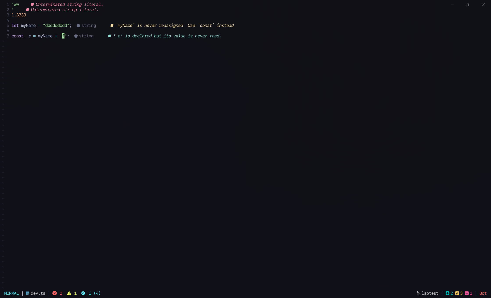

# darkdarcool's NeoVim Configuration

> This configuration is completely made for me, and I won't be changing anything for you. Feel free to fork it and change anything you want



## Installation

Make sure to back up your own configuration before installing this one:

```bash
# Unix (bash)
cp ~/.config/nvim ~/.config/nvim.backup/

# Windows (powershell)
Copy-Item ~/AppData/Local/nvim ~/AppData/Local/nvim.backup/
```

Install the new configuration:

```
# Unix (bash)
git clone https://github.com/darkdarcool/nvim ~/.config/nvim/

# Windows (powershell)
Copy-Item clone https://github.com/darkdarcool/nvim ~/AppData/Local/nvim/
```
